<!-- Generated panels live in ./assets — rebuild with `python3 build.py` -->

  

  <b>SDE Intern @ Amazon</b> · <b>Founding Engineer @ ChemVecto</b> 
  B.E. (Hons.) Computer Science + M.Sc. (Hons.) Biological Sciences · BITS Pilani, Goa · '27 
  <a href="mailto:work.devanshmehta@gmail.com">Email</a> ·
  <a href="https://www.linkedin.com/in/devanshme">LinkedIn</a>

  

<h3 align="center"><code>devansh@os ~ $ ls ./systems</code></h3>

  
  
  
  
  
  

  also: <a href="https://github.com/dumbanshm/sparkathon">sparkathon</a> (retail waste recsys) ·
  <a href="https://github.com/dumbanshm/contest-reminders">contest-reminders</a> ·
  <a href="https://github.com/dumbanshm/placement-enforcer-android-app">placement-enforcer</a> ·
  <a href="https://github.com/dumbanshm/gocrypt">gocrypt</a>

  

  

