<!-- Generated by build.py. Edit that, then run `python3 build.py`. -->

  

  

  

  <a href="https://github.com/dumbanshm/devansh-OS"></a>
  <a href="https://confidently-wrong-silk.vercel.app"></a>
  <a href="https://codeweb-8z86.onrender.com"></a>
  <a href="https://code-climb-nu.vercel.app"></a>
  <a href="https://github.com/dumbanshm/InSilicomate"></a>
  <a href="https://hexago-five.vercel.app"></a>

  

  <a href="https://hexago-five.vercel.app/#lets-chat"></a>
  
  <a href="https://www.linkedin.com/in/devanshme"></a>
  <a href="https://drive.google.com/drive/folders/1iT8INlIgLucSlDIcRWyVtYFwWAHjQjQm?usp=sharing"></a>

