<!-- Generated by build.py. Edit that, then run `uv run --with fonttools --with brotli python build.py`. -->

  <picture><source media="(prefers-color-scheme: dark)" srcset="./assets/header-dark-e1cc26f9.svg" /></picture>

  <a href="https://github.com/dumbanshm/devansh-OS"><picture><source media="(prefers-color-scheme: dark)" srcset="./assets/row-devansh-os-dark-8e45e8ff.svg" /></picture></a>
  <a href="https://confidently-wrong-silk.vercel.app"><picture><source media="(prefers-color-scheme: dark)" srcset="./assets/row-confidently-wrong-dark-462c85c3.svg" /></picture></a>
  <a href="https://codeweb-8z86.onrender.com"><picture><source media="(prefers-color-scheme: dark)" srcset="./assets/row-codeweb-dark-01760774.svg" /></picture></a>
  <a href="https://code-climb-nu.vercel.app"><picture><source media="(prefers-color-scheme: dark)" srcset="./assets/row-codeclimb-dark-82f5e0f1.svg" /></picture></a>
  <a href="https://github.com/dumbanshm/InSilicomate"><picture><source media="(prefers-color-scheme: dark)" srcset="./assets/row-insilicomate-dark-80d39115.svg" /></picture></a>
  <a href="https://hexago-five.vercel.app"><picture><source media="(prefers-color-scheme: dark)" srcset="./assets/row-hexago-dark-c26577a0.svg" /></picture></a>

  <a href="https://hexago-five.vercel.app/#lets-chat"><picture><source media="(prefers-color-scheme: dark)" srcset="./assets/contact-dark-fe2c15ac.svg" /></picture></a>
  <a href="mailto:work.devanshmehta@gmail.com"><picture><source media="(prefers-color-scheme: dark)" srcset="./assets/btn-email-dark-7acf585a.svg" /></picture></a>
  <a href="https://www.linkedin.com/in/devanshme"><picture><source media="(prefers-color-scheme: dark)" srcset="./assets/btn-linkedin-dark-b97e995f.svg" /></picture></a>
  <a href="https://drive.google.com/drive/folders/1iT8INlIgLucSlDIcRWyVtYFwWAHjQjQm?usp=sharing"><picture><source media="(prefers-color-scheme: dark)" srcset="./assets/btn-resume-dark-ac611ce8.svg" /></picture></a>

